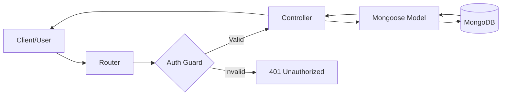

# 🗨️ Chatapp Backend

A high-performance, scalable backend for real-time communication, built on a modern Node.js stack. This project implements a clean **Model-View-Controller (MVC)** architecture to manage users, authentication, and messaging with persistent storage and cloud-based media handling.

---

## � Project Structure

```text
backend/
├── controllers/          # Business logic & Request handling
│   ├── auth.controller.js
│   └── message.controller.js
├── database/             # Database connection & config
│   └── connection.js
├── lib/                  # External integrations (Cloudinary, etc.)
│   └── cloudinary.js
├── middleware/           # Route guards & common functions
│   └── auth.middelware.js
├── models/               # Mongoose schemas (Data structure)
│   ├── user.model.js
│   └── message.model.js
├── routes/               # API route definitions
│   ├── auth.router.js
│   └── message.router.js
├── utils/                # Helper functions (JWT, etc.)
│   └── utils.js
├── app.js               # Main entry point
├── .env                  # Environment configuration
└── package.json          # Dependencies & Scripts
```

---

## 🏗️ Architecture & Flow

The backend follows a strict **MVC** pattern to isolate concerns and ensure maintainability.

### Request-Response Flow



- **Models**: Act as the single source of truth for data structure and business constraints.
- **Controllers**: Process requests, interact with models, and return appropriate responses.
- **Routes**: Map URL paths to specific controller actions.

---

## � Comprehensive API Documentation

### 1. Authentication (`/api/auth`)

| Method   | Endpoint          | Description             | Request Body                      | Auth |
| :------- | :---------------- | :---------------------- | :-------------------------------- | :--: |
| **POST** | `/register`       | Sign up a new user      | `{email, fullName, password}`     |  ❌  |
| **POST** | `/login`          | Authenticate user       | `{email, password}`               |  ❌  |
| **POST** | `/logout`         | Clear session cookie    | `None`                            |  ❌  |
| **POST** | `/update-profile` | Change profile pic/name | `{fullName, profilePic}` (Base64) |  ✅  |
| **GET**  | `/check-auth`     | Get current user info   | `None`                            |  ✅  |

#### **Example Success Response (`/login`)**

```json
{
  "success": true,
  "message": "User Logged In Successfully",
  "user": {
    "_id": "6771...",
    "email": "user@example.com",
    "fullName": "John Doe",
    "profilePic": "https://res.cloudinary.com/..."
  }
}
```

### 2. Messaging (`/api/message`)

| Method   | Endpoint    | Description            | URL Params         | Request Body        |
| :------- | :---------- | :--------------------- | :----------------- | :------------------ |
| **GET**  | `/users`    | List users for sidebar | `None`             | `None`              |
| **GET**  | `/:id`      | Fetch chat history     | `id` (Target User) | `None`              |
| **POST** | `/send/:id` | Send text or media     | `id` (Receiver)    | `{message, media?}` |

#### **Example Success Response (`/send/:id`)**

```json
{
  "success": true,
  "message": "Message Sent",
  "newMessage": {
    "sender": "6771...",
    "receiver": "6772...",
    "message": "Hello!",
    "media": null,
    "_id": "6773...",
    "createdAt": "2025-..."
  }
}
```

---

## �️ Security & Authentication

### JWT & HTTP-Only Cookies

- **Stateless Auth**: We use **JSON Web Tokens** for session management.
- **Secure Cookies**: The token is stored in an `httpOnly` cookie. This prevents client-side scripts (XSS) from accessing the token.
- **Auth Guard**: The `protectedRoute` middleware automatically validates the cookie on every sensitive request and populates `req.user`.

### Data Security

- **Password Hashing**: Passwords are never stored in plain text. We use `bcryptjs` with 10 salt rounds.
- **Data Filtering**: The sensitive `password` field is automatically excluded from responses using `.select("-password")`.

---

## ☁️ Media Management (Cloudinary)

This project integrates Cloudinary for seamless media handling:

1.  Clients send images as **Base64 strings**.
2.  The `auth.controller` or `message.controller` uploads the string to Cloudinary.
3.  Cloudinary returns a **Secure URL** which we store in MongoDB.
4.  This keeps our database light and ensures fast image delivery via CDN.

---

## 🚀 Getting Started

### Prerequisites

- Node.js installed
- MongoDB URI (Atlas or Local)
- Cloudinary Account

### Installation

1.  **Install dependencies**:
    ```bash
    npm install
    ```
2.  **Environment Setup**: Create a `.env` file based on the following template:
    ```env
    PORT=3000
    MONGODB_URI=your_uri_here
    JWT_SECRET=your_long_random_secret
    CLOUDINARY_CLOUD_NAME=name
    CLOUDINARY_API_KEY=key
    CLOUDINARY_API_SECRET=secret
    ```
3.  **Development Mode**:
    ```bash
    npm run dev
    ```

---

_Built with ❤️ for a seamless chat experience._
